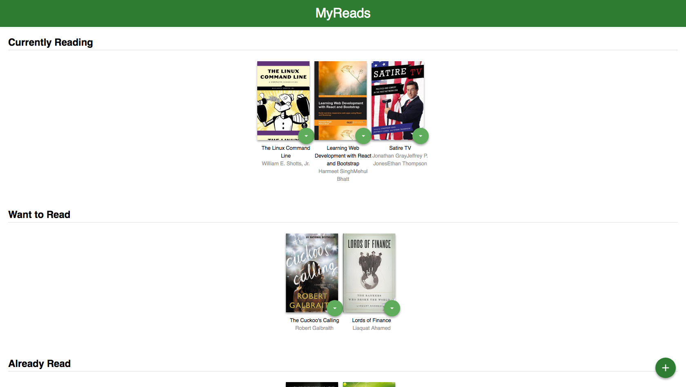
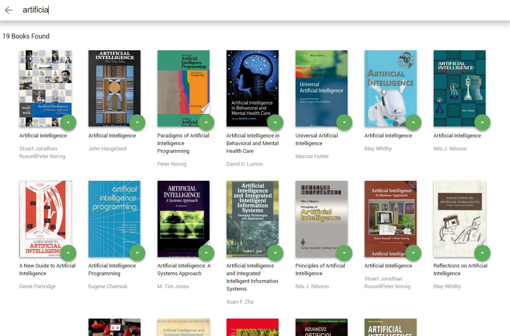

# Projeto Myreads

Este repositório contem uma aplicação desenvolvida com ReactJS. Este é o projeto de avaliação final do curso Fundamentos de React da Udacity, parte do Programa React Nanodegree. MyReads é uma  aplicação de estante de livros que permite selecionar e classificar os livros que você já leu, está lendo ou quer ler. Na página inicial está a estante com livros, e cada livro tem um controle que permite selecionar uma estante para ele. Quando você seleciona uma prateleira diferente, o livro é movido para lá.

A página inicial possui ainda um link para uma página de pesquisa de livros, onde permite que você encontre livros para adicionar à sua biblioteca.

### Instalação

```
git clone https://github.com/gilmarvogel/myreads.git
* cd MyReads -- acesse a pasta
* npm install -- instalar pacotes
* npm start -- iniciar o aplicativo
```






